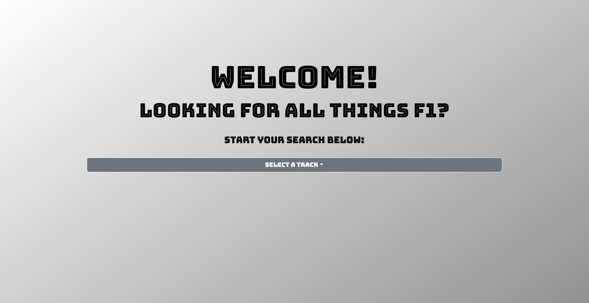
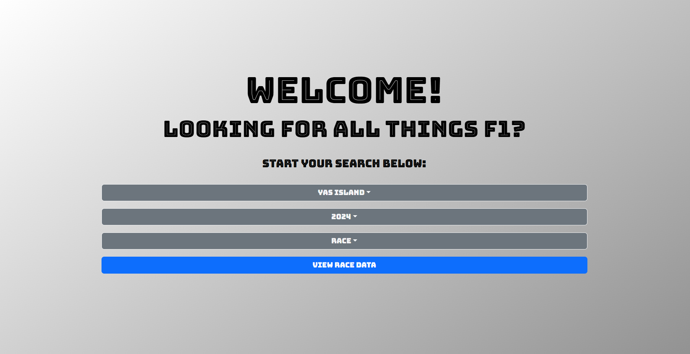
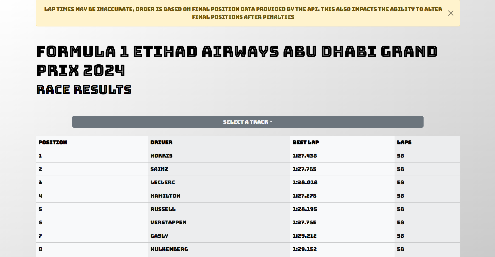
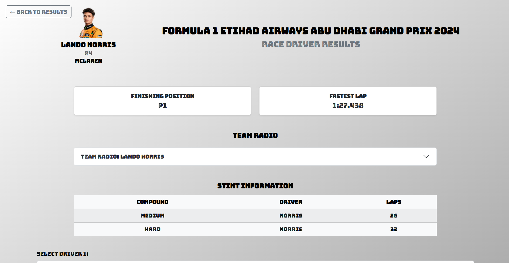

# F1 Data Explorer (React)

A Formula 1 data exploration app built with **React.js** that lets you dive deep into F1 race sessions, track-specific stats, and individual driver data.

Powered by the free and open [OpenF1 API](https://openf1.org/).

> ⚠️ **Note**: The OpenF1 API is **not accessible during official F1 sessions** due to restrictions. Please explore data during non-live periods.

---

## 🚀 Features

- 🔍 Search and filter F1 sessions by:
  - **Track**
  - **Year**
  - **Session type** (Practice, Qualifying, Race)
  
- 📊 View detailed data for individual drivers:
  - Best lap times
  - Final position
  - Team radio
  - Stint breakdown
  - Lap-by-lap performance chart

---

## 📸 Preview

### 🏠 Home Page


### 🔎 Search Dropdowns


### 📄 Session Results


### 👤 Driver Details


---

## 🛠 Tech Stack

- React.js (Vite)
- Bootstrap 5
- Framer Motion for animations
- React Router
- [OpenF1 API](https://openf1.org/)

---

## 🧑‍💻 Getting Started

### Prerequisites

- Node.js and npm installed

### Installation

```bash
git clone https://github.com/RandyKR1/f1-data-react.git
cd f1-data-react
npm install
